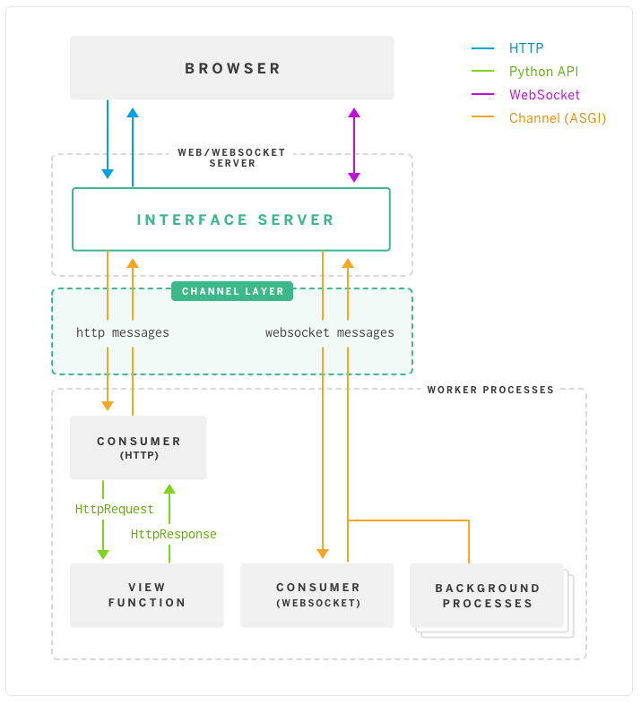

# Chat application with channels

WebSocket is a protocol for real-time communication. It provides full-duplex communication, a persistent connection, between the client and server, with either able to send data at any time, or receive data at any time. At its core, Django is built around the simple concept of requests and responses: the browser makes a request, Django calls a view, which returns a response that’s sent back to the browser:


This doesn’t work with WebSockets! The view is only around for the lifespan of a single request, and there’s no mechanism to hold open a connection or send data down to the client without an associated request.

Django Channels. Channels, in a nutshell, replaces the “guts” of Django — the request/response cycle — with messages that are sent across channels. Channels allows Django to support WebSockets in a way that’s very similar to traditional HTTP views. Channels also allow for background tasks that run on the same servers as the rest of Django. HTTP requests continue to behave the same as before, but also get routed over channels. Thus, under Channels Django now looks like this:

Channels wraps Django’s native asynchronous view support, allowing Django projects to handle not only HTTP, butprotocols that require long-running connections too - WebSockets, MQTT, chatbots, amateur radio, and more.It does this while preserving Django’s synchronous and easy-to-use nature, allowing you to choose how you writeyour code - synchronous in a style like Django views, fully asynchronous, or a mixture of both. On top of this, itprovides integrations with Django’s auth system, session system, and more, making it easier than ever to extend yourHTTP-only project to other protocols.Channels also bundles this event-driven architecture withchannel layers, a system that allows you to easily communi-cate between processes, and separate your project into different processes



Channels are essentially task queues: messages get pushed onto the channel by producers, and then given to one of the consumers listening on that channel. If you’ve used channels in Go, the concept should be fairly familiar. The main difference is that Django channels work across a network and allow producers and consumers to run transparently across many dynos and/or machines. This network layer is called the channel layer. Channels is designed to use Redis as its preferred channel layer, though there is support for other types (and a first-class API for creating custom channel layers). There are neat and subtle technical details; consult the documentation for the full story.

## Sync vs Async

Because of the differences between Channels and Django, we'll have to frequently switch between `sync` and `async` code execution. For example, the Django database needs to be accessed using **synchronous** code while the Channels channel layer needs to be accessed using **asynchronous** code. Real time readings will occur asyncronously, however, the storage needs to be in syncronous mode.

The easiest way to switch between the two is by using the built-in Django asgiref (asgrief.sync) functions:

`sync_to_async` - takes a sync function and returns an async function that wraps it
`async_to_sync` - takes an async function and returns a sync function

## Project Setup

We'll be building a chat application. The app will have multiple rooms where Django authenticated users can chat. Each room will have a list of currently connected users. We'll also implement private, one-to-one messaging.

Since we'll be using WebSockets instead of HTTP to communicate from the client to the server, we need to wrap our `ASGI` config with `ProtocolTypeRouter` in `core/asgi.py`. This router will route traffic to different parts of the web application depending on the protocol used. Next, we need to let Django know the location of our ASGI application. Add the following to your `core/settings.py` file, just below the `WSGI_APPLICATION` setting:

#### ProtocolTypeRouter

`channels.routing.ProtocolTypeRouter`

This lets you dispatch to one of a number of other ASGI applications based on the type value present in the scope. Protocols will define a fixed type value that their scope contains, so you can use this to distinguish between incoming connection types.

It takes a single argument - a dictionary mapping type names to ASGI applications that serve them:

```python
ProtocolTypeRouter({
    "http": some_app,
    "websocket": some_other_app,
})
```

### Add channel layer

Channel layers allow you to talk between different instances of an application. They’re a useful part of making a distributed realtime application if you don’t want to have to shuttle all of your messages or events through a database. `channels_redis` is the only official Django-maintained channel layer supported for production use. The layer uses Redis as its backing store, and supports both a single-server and sharded configurations, as well as group support. To use this layer you’ll need to install the `channels_redis` package.

A channel layer is a kind of communication system. It allows multiple consumer instances to talk with each other, and with other parts of Django.
A channel layer provides the following abstractions:

- A channel is a mailbox where messages can be sent to. Each channel has a name. Anyone who has the name of a channel can send a message to the channel.
- A group is a group of related channels. A group has a name. Anyone who has the name of a group can add/remove a channel to the group by name and send a message to all channels in the group. It is not possible to enumerate what channels are in a particular group.

Every consumer instance has an automatically generated unique channel name, and so can be communicated with via a channel layer.

In our chat application we want to have multiple instances of `ChatConsumer` in the **same room** communicate with each other. To do that we will have each `ChatConsumer` add its channel to a group whose name is based on the room name. That will allow ChatConsumers to transmit messages to all other ChatConsumers in the same room.

`pip install channels_redis`

We need a channel layer to give consumers (which we'll implement in the next step) the ability to talk to one another. While we could use use the `InMemoryChannelLayer` layer since we're in development mode, we'll use a `production-ready` layer, `RedisChannelLayer`.

Since this layer requires Redis, run the following command to get it up and running with Docker:

`docker run -p 6379:6379 -d --name redis-layer redis:alpine`

```python
CHANNEL_LAYERS = {
    'default': {
        'BACKEND': 'channels_redis.core.RedisChannelLayer',
        'CONFIG': {
            "hosts": [('127.0.0.1', 6379)],
        },
    },
}
```

To test if everything works as expected, open the Django shell `python manage.py shell` and run the following commands:

```python
import channels.layers
from asgiref.sync import async_to_sync

channel_layer = channels.layers.get_channel_layer()
async_to_sync(channel_layer.send)('test_channel', {'type': 'hello'})
async_to_sync(channel_layer.receive)('test_channel')
```

Here, we connected to the channel layer using the settings defined in `config/settings.py`. We then used `channel_layer.send` to send a message to the `test_channel` **group** and `channel_layer.receive` to **read all the messages sent to the same group**.

### Add Channels Consumer

A consumer is the basic unit of Channels code. They are tiny ASGI applications, driven by events. They are akin to Django views. However, unlike Django views, consumers are long-running by default. A Django project can have multiple consumers that are combined using Channels routing. Each consumer has it's own scope, which is a set of details about a single incoming connection. They contain pieces of data like `protocol type`, `path`, `headers`, `routing arguments`, `user agent`, and more.

When Django receives an HTTP request, it consults the root URLconf to lookup a view ad calls the view to handle the request. Similarly, when Channels accepts a WebSocket connection, it consults the root routing configuration to lookup a consumer, and then calls various functions on the consumer to handle events from the connection.

We will write a basic consumer that accepts WebSocket connections on the path `/ws/chat/ROOM_NAME/` that takes any message it receives on the WebSocket and echos it back to the same WebSocket

#### Scopes and events

Channels and ASGI split up incoming connections into two components: **a scope, and a series of events**. The scope is a set of details about a single incoming connection - such as the path a web request was made from, or the originating IP address of a WebSocket, or the user messaging a chatbot - and persists throughout the connection.

For HTTP, the scope just lasts a single request. For WebSockets, it lasts for the lifetime of the socket (but changes if the socket closes and reconnects).

So to get the details of the connection we need to access the scope. To do this, we use the `scope` argument. During the lifetime of this scope, a series of events occur. These represent user interactions - making a HTTP request, for example, or sending a WebSocket frame. Your Channels or ASGI applications will be instantiated once per scope, and then be fed the stream of events happening within that scope to decide what to do with.

So, when a channel accept a conexion it creates a scope and events. The scope contains information about the connection, during this connection, a series of events occur, which can be HTTP requests or a WebSocket frame.

When a user posts a message, a JavaScript function will transmit the message over **WebSocket** to a `ChatConsumer`. The `ChatConsumer` will receive that message and forward it to the group corresponding to the room name. Every `ChatConsumer` in the same `group` (and thus in the same room) will then receive the message from the group and forward it over `WebSocket` back to **JavaScript**, where it will be appended to the chat log.

At this point, if the room name is `default`, then the URL generated will be `/chat/default/` and the `ChatConsumer` will be instantiated with this `room_name` in the scope. Every consumer with the same `room_name` will belong to the same group and will receive the same messages.

```python
self.scope['url_route']['kwargs']['room_name']
```

- Obtains the `room_name` parameter from the URL route in `chat/routing.py` that opened the WebSocket connection to the consumer.
- Every consumer has a scope that contains information about its connection, including in particular any positional or keyword arguments from the URL route and the currently authenticated user if any.

```python
self.room_group_name = f'chat_{self.room_name}'
```

- Constructs a Channels group name directly from the user-specified room name, without any quoting or escaping.
- Group names may only contain alphanumerics, hyphens, underscores, or periods. Therefore this example code will fail on room names that have other characters.

```python
async_to_sync(self.channel_layer.group_add)(...)
```

- Joins a group
- The async_to_sync(. . . ) wrapper is required because ChatConsumer is a synchronous WebsocketConsumer but it is calling an asynchronous channel layer method. (All channel layer methods are asynchronous.

## WebSockets (frontend)

To communicate with Channels from the frontend, we'll use the WebSocket API.

WebSockets are extremely easy to use. First, you need to establish a connection by providing a url and then you can listen for the following events:

- onopen - called when a WebSocket connection is established
- onclose - called when a WebSocket connection is destroyed
- onmessage - called when a WebSocket receives a message
- onerror - called when a WebSocket encounters an error
  To integrate WebSockets into the application, add the following to the bottom of room.js:

## Authentication

#### Backend

Channels comes with a built-in class for Django session and authentication management called `AuthMiddlewareStack`.

To use it, the only thing we have to do is to wrap `URLRouter` inside `config/asgi.py` like so:

Now, whenever an authenticated client joins, the user object will be added to the scope. It can accessed like so:

`user = self.scope['user']`

Another option is to implement authentication in the frontend using json web tokens.

## References

- [Heroku Channels Post](https://blog.heroku.com/in_deep_with_django_channels_the_future_of_real_time_apps_in_django)
- [testdriven.io](https://testdriven.io/blog/django-channels/)
- [Channels documentation](https://channels.readthedocs.io/en/stable/introduction.html)
- [Real Python Channels Tutorial](https://realpython.com/getting-started-with-django-channels/)
- [Raeact client side](https://www.atatus.com/blog/websockets-tutorial-going-real-time-with-node-and-react/)
- Channels. Read the Docs (pdf)

More information in:

- [DJANGO CHANNELS 2 Tutorial (V2)](https://www.youtube.com/watch?v=RVH05S1qab8)
- [Django Channels and WebSockets](https://blog.logrocket.com/django-channels-and-websockets/)
- [Django Channels & WebSockets Oversimplified](https://www.youtube.com/watch?v=cw8-KFVXpTE)
- **Atomated testing part in Read the docs.pdf with selenium**
